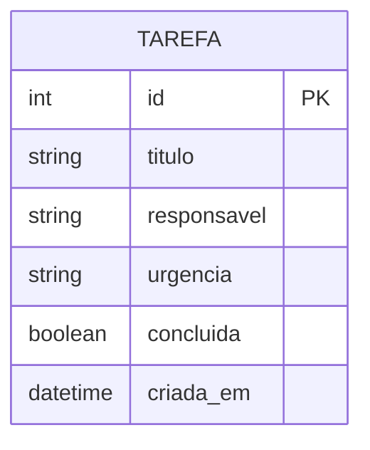

# Roteiro da Apresentação — Sprint 3 (até 15 minutos)

**Sistema:** Agile TaskTracker (Gerenciador de Tarefas Ágeis)  
**Disciplina:** Front-end Web (React)  
**Tempo total:** 15 minutos (todos os integrantes falam; dividir o tempo igualmente)

> **Regra de ouro:** não leia os slides — explique com suas palavras. Os slides são apoio visual; a demonstração ao vivo é o centro da avaliação.

---

## Critérios de avaliação (o que o professor vai observar)

| Critério | Como demonstrar na apresentação |
|----------|----------------------------------|
| Aplicação React completa no navegador | App rodando com `npm run dev`, navegação entre páginas |
| Consumo de API REST com CRUD completo | Demo ao vivo: criar, listar, editar, excluir tarefa |
| Qualidade do código React | Mostrar pastas, componentização, services e hook customizado |
| Clareza da apresentação | Explicar *por que* cada decisão técnica foi tomada |
| Repositório atualizado | Mencionar commits frequentes de todos os integrantes |

---

## Divisão de tempo sugerida (equipe de 3 integrantes — ~5 min cada)

Ajuste os nomes e tempos conforme o tamanho real do grupo.

| Integrante | Tempo | Responsabilidade na fala |
|------------|-------|--------------------------|
| Integrante 1 | 0:00 – 5:00 | Capa, problema, contexto do sistema |
| Integrante 2 | 5:00 – 10:00 | Modelagem ER (BD) + API back-end (slides do time de BD/Back) |
| Integrante 3 | 10:00 – 15:00 | Componentes React, demo ao vivo e código-fonte |

Se forem **4 integrantes**, use ~3 min 45 s cada. Se forem **2**, use ~7 min 30 s cada.

---

## Estrutura dos slides (7 blocos)

### Slide 1 — Capa
**Conteúdo do slide:**
- Nome do sistema: **Agile TaskTracker**
- Nome da disciplina / Sprint 3
- Nomes completos dos integrantes e papéis (Front, Back, BD)

**O que falar (não ler):**
> "Somos o grupo [X] e desenvolvemos o Agile TaskTracker, um sistema para equipes ágeis organizarem tarefas com responsável e nível de urgência. Na Sprint 3 integramos o front-end React com a API REST do nosso back-end."

---

### Slide 2 — Problema que o sistema resolve
**Conteúdo do slide:**
- Times ágeis perdem visibilidade das tarefas
- Falta de priorização (urgência)
- Dados espalhados / sem centralização

**O que falar:**
> "O problema é a falta de um lugar único para criar, acompanhar e priorizar tarefas da sprint. Nosso sistema centraliza isso no navegador, com dados persistidos no banco via API."

---

### Slide 3 — Modelagem ER (disciplina de BD)
**Responsabilidade:** integrante do time de Banco de Dados  
**Conteúdo do slide:**
- Diagrama ER da entidade `Tarefa` (ou tabelas relacionadas)
- Campos: `id`, `titulo`, `responsavel`, `urgencia`, `concluida`, `criada_em`
- Tipos e relacionamentos (se houver mais entidades)

**O que falar:**
> "No banco, modelamos a entidade Tarefa com os campos que o front consome. O `id` é a chave primária; os demais campos refletem o formulário React."

**Sugestão visual (Mermaid para colar no slide ou exportar imagem):**



---

### Slide 4 — Interfaces e serviços back-end (disciplina de Back-end)
**Responsabilidade:** integrante do time de Back-end  
**Conteúdo do slide:**
- Stack: Node.js + Express (ou a stack usada pelo grupo)
- Endpoints REST expostos
- Exemplo de JSON de request/response

**O que falar:**
> "O back-end expõe uma API RESTful. O front não acessa o banco diretamente — tudo passa por HTTP com os verbos corretos para cada operação."

**Contrato da API esperado pelo front-end:**

| Operação | Método | Endpoint | Descrição |
|----------|--------|----------|-----------|
| **Read (lista)** | `GET` | `/api/tasks` | Retorna array de tarefas |
| **Read (uma)** | `GET` | `/api/tasks/:id` | Retorna uma tarefa |
| **Create** | `POST` | `/api/tasks` | Cria tarefa; retorna objeto criado (201) |
| **Update** | `PUT` | `/api/tasks/:id` | Atualiza tarefa; retorna objeto atualizado |
| **Delete** | `DELETE` | `/api/tasks/:id` | Remove tarefa (204 ou JSON de confirmação) |

**Exemplo de JSON (tarefa):**
```json
{
  "id": 1,
  "title": "Desenvolver API de login",
  "assignee": "João Silva",
  "urgency": "Alta",
  "completed": false,
  "createdAt": "2026-06-09T12:00:00.000Z"
}
```

**Importante para o back-end:** habilitar CORS para `http://localhost:5173` (porta do Vite).

---

### Slide 5 — Componentes e páginas React
**Responsabilidade:** integrante de Front-end  
**Conteúdo do slide:**
- Árvore de pastas do projeto
- Páginas: Dashboard, Nova Tarefa, Editar Tarefa, Sobre
- Componentes reutilizáveis: Navbar, TaskForm, TaskList, LoadingSpinner, ErrorAlert
- Camada de serviços: `api.js`, `taskService.js`
- Hook: `useTasks.js`

**O que falar:**
> "Organizamos o código em camadas. As páginas cuidam da tela, os componentes da UI reutilizável, os services isolam as chamadas HTTP e o hook `useTasks` centraliza o estado das tarefas."

**Estrutura do projeto:**
```
src/
├── services/
│   ├── api.js           → cliente HTTP genérico (fetch)
│   └── taskService.js   → CRUD de tarefas
├── hooks/
│   └── useTasks.js      → estado + operações da API
├── components/
│   ├── Navbar.jsx
│   ├── TaskForm.jsx     → formulário controlado (create/edit)
│   ├── TaskList.jsx     → listagem dinâmica
│   ├── LoadingSpinner.jsx
│   └── ErrorAlert.jsx
├── pages/
│   ├── Dashboard.jsx    → Read (lista)
│   ├── CreateTask.jsx   → Create
│   ├── EditTask.jsx     → Read + Update
│   └── About.jsx
└── App.jsx              → rotas React Router
```

**Decisões técnicas para explicar:**
1. **Formulário controlado** (`useState` em `TaskForm.jsx`) — React controla os inputs.
2. **Separação de responsabilidades** — UI não chama `fetch` diretamente; usa `taskService`.
3. **Tratamento de erros** — mensagens amigáveis quando a API está offline.
4. **Rota dinâmica** — `/edit/:id` para edição de tarefa específica.

---

### Slide 6 — Demo ao vivo (CRUD completo)
**Todos participam da demo; um integrante opera, outros narram.**

**Checklist antes da apresentação:**
- [ ] Back-end rodando (ex.: `http://localhost:3000`)
- [ ] Front-end rodando: `cd SPRINT2 && npm run dev`
- [ ] Arquivo `.env` com `VITE_API_URL=http://localhost:3000/api`
- [ ] Banco com dados ou vazio (tanto faz — crie na hora)

**Roteiro da demo (≈ 4 min):**

| Passo | Ação na tela | Operação CRUD | Arquivo para citar depois |
|-------|--------------|---------------|---------------------------|
| 1 | Abrir Dashboard | **Read** | `taskService.getAll()` / `useTasks.js` |
| 2 | Ir em "Nova Tarefa", preencher e salvar | **Create** | `taskService.create()` / `CreateTask.jsx` |
| 3 | Voltar ao Dashboard — tarefa aparece na lista | **Read** | `TaskList.jsx` (`.map()`) |
| 4 | Clicar em "Editar", alterar título/urgência, salvar | **Update** | `taskService.update()` / `EditTask.jsx` |
| 5 | Clicar em "Concluir" | **Update** (parcial) | `toggleTaskStatus` em `useTasks.js` |
| 6 | Clicar em "Excluir" | **Delete** | `taskService.delete()` |
| 7 | Atualizar página (F5) — dados persistem no banco | Persistência via API | Diferenciar da Sprint 2 (localStorage) |

**Frase de impacto:**
> "Cada ação na interface dispara uma requisição HTTP ao back-end, que persiste no banco. Isso é integração full-stack real."

---

### Slide 7 — Código-fonte (breve explicação)
**Tempo:** ~2 min — mostrar 3 arquivos-chave, sem scroll infinito.

#### Arquivo 1: `src/services/taskService.js`
**Mostrar:** métodos `getAll`, `getById`, `create`, `update`, `delete`  
**Explicar:** "Aqui centralizamos o CRUD. Se a URL da API mudar, alteramos só este arquivo."

#### Arquivo 2: `src/hooks/useTasks.js`
**Mostrar:** `fetchTasks` no `useEffect` e funções `addTask`, `updateTask`, `removeTask`  
**Explicar:** "O hook gerencia estado e sincroniza a UI após cada resposta da API."

#### Arquivo 3: `src/components/TaskForm.jsx`
**Mostrar:** `useState` para `title`, `assignee`, `urgency` e `onChange` nos inputs  
**Explicar:** "Formulário controlado reutilizado na criação e na edição — boa prática de componentização."

---

## Encerramento (30 segundos — qualquer integrante)

> "Concluímos a Sprint 3 com o sistema integrado: React no navegador consumindo API REST com CRUD completo. O repositório está atualizado com commits de todos os integrantes. Obrigado!"

---

## Preparação técnica (dia da apresentação)

### Subir o front-end
```bash
cd SPRINT2
cp .env.example .env    # ajuste a URL se necessário
npm install
npm run dev
```

### Variável de ambiente
```
VITE_API_URL=http://localhost:3000/api
```

### Possíveis problemas e respostas

| Problema | Solução rápida |
|----------|----------------|
| "Erro ao carregar tarefas" na tela | Verificar se o back-end está rodando |
| CORS bloqueado no navegador | Back-end precisa liberar origem `http://localhost:5173` |
| Edição não salva | Conferir se `PUT /api/tasks/:id` está implementado |
| ID numérico vs string | O front normaliza comparação de IDs com `String()` |

---

## Dicas para nota máxima

1. **Não leia slides** — use bullets como gancho para explicar.
2. **Demo primeiro, código depois** — o professor quer ver funcionando.
3. **Todos falam** — distribua slides e trechos de demo antes.
4. **Commits** — mostre no GitHub que cada integrante commitou (prints ou link).
5. **Conecte as disciplinas** — ER (BD) → API (Back) → React (Front) na mesma história.
6. **Compare com Sprint 2** — "Antes usávamos localStorage; agora os dados vêm da API e persistem no banco."

---

## Checklist final do grupo

- [ ] Slides criados (7 blocos acima)
- [ ] Nomes dos integrantes preenchidos (capa + página Sobre)
- [ ] Back-end com CRUD completo de `/api/tasks`
- [ ] Front-end testado com API ligada
- [ ] Demo ensaiada (cronometrar 15 min)
- [ ] Repositório com commits de todos os integrantes
- [ ] `.env` configurado (não commitar segredos — só `.env.example`)
